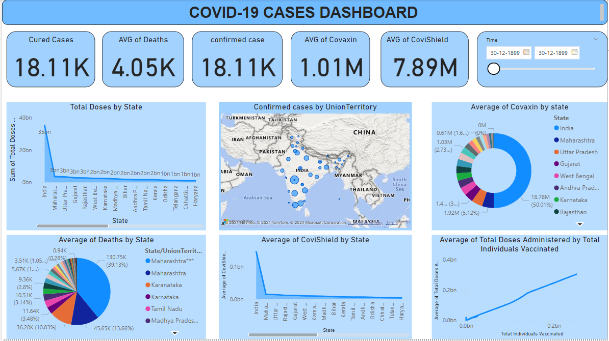

# Global COVID-19 Database Dashboard



## Table of Contents
1. [Introduction](#introduction)
2. [Features](#features)
3. [Data Sources](#data-sources)
4. [Installation](#installation)
5. [Usage](#usage)
6. [Dashboard Insights](#dashboard-insights)
7. [Contributing](#contributing)
8. [License](#license)
9. [Contact](#contact)

## Introduction
The **Global COVID-19 Database Dashboard** is an interactive Power BI dashboard designed to visualize and analyze global COVID-19 data. This project was created during my internship to provide insights into the pandemic's trends, helping users understand the impact of COVID-19 across different countries and regions.

## Features
- **Global Overview**: Key metrics such as total cases, deaths, and recoveries worldwide.
- **Country Comparison**: Compare COVID-19 statistics between selected countries.
- **Trend Analysis**: Visualize trends over time for cases, deaths, and recoveries.
- **Data Filtering**: Filter data by date, country, and other relevant criteria.
- **Interactive Visualizations**: Various charts and graphs for an in-depth analysis.

## Data Sources
The data used in this dashboard is sourced from reliable and publicly available datasets, including:
- [World Health Organization (WHO)](https://www.who.int/)
- [Johns Hopkins University](https://coronavirus.jhu.edu/)
- [Our World in Data](https://ourworldindata.org/coronavirus)

## Installation
To view and interact with the Power BI dashboard, follow these steps:
1. **Download Power BI Desktop**: [Download Here](https://powerbi.microsoft.com/desktop/)
2. **Clone this repository**:
   ```sh
   git clone https://github.com/yourusername/Global_Covid19_Database_Dashboard.git
3. **Open the Dashboard**:
   Open Power BI Desktop.
   Click on File > Open and select the Global_Covid19_Database_Dashboard.pbix file from the cloned repository.
   **Usage**:
   Once the dashboard is open in Power BI Desktop:

   Use the interactive filters to customize the data view.
   Click on different visualizations to see detailed insights.
   Explore various tabs/pages within the dashboard for specific analyses (e.g., global overview, country comparison, trend analysis).
  **Dashboard Insights**:
    ***Global Overview***:
    Presents a high-level summary of COVID-19 statistics worldwide.
    Key metrics include total confirmed cases, deaths, and recoveries.
    Country Comparison
    Allows users to compare COVID-19 data between multiple countries.
    Features bar charts and line graphs to illustrate differences and trends.
    Trend Analysis
    Visualizes the progression of COVID-19 cases, deaths, and recoveries over time.
    Includes time-series charts to track daily and cumulative figures.
  **Contributing**:
    Contributions are welcome! Please follow these steps to contribute:

    Fork the repository.
    Create a new branch (git checkout -b feature/your-feature-name).
    Commit your changes (git commit -m 'Add some feature').
    Push to the branch (git push origin feature/your-feature-name).
    Open a Pull Request.
  **License**:
    This project is licensed under the MIT License. See the LICENSE file for details.

  **Contact**:
    For any questions, suggestions, or feedback, feel free to contact me:

    Name: Monali Mohite
    Email: monali.mohite1997@gmail.com
    LinkedIn: www.linkedin.com/in/monali-mohite-234343153
